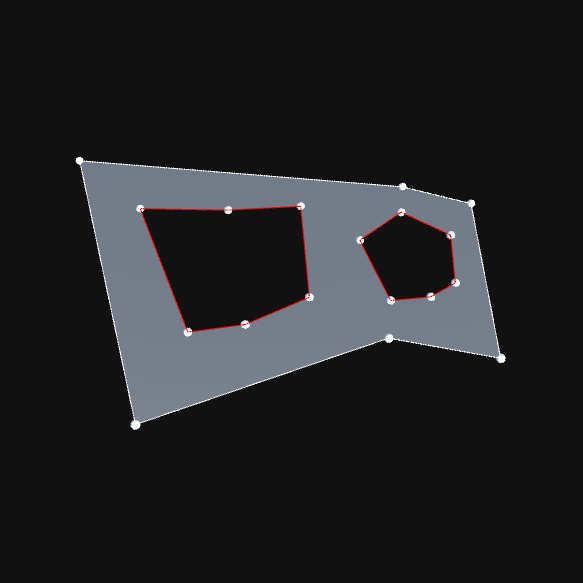

# triangle-net-debug

Unity set up for debugging triangulation issues within Triangle.Net.

Uses slightly modified verion of Triangle.net from [repo](https://github.com/akopetsch/triangle-unity).

## Use

The `example` scene contains a basic example triangulation setup.

#### Contour : MonoBehaviour

Collects the child objects within itself and generates a loop from them. Has utility functions for creating a `TriangleNet.Geometry.Contour` object for triangulation, as well.

If the `hole` flag is enabled, then the contour will be triangulated as a hole.

#### CreateMesh : MonoBehaviour

Collects all the contour objects within the scene and triangulates them into a single mesh.
